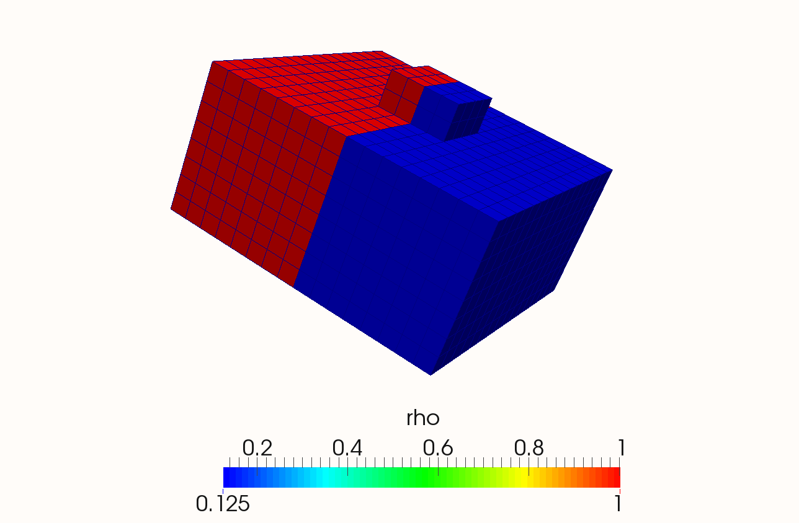

HOM3
====

A laboratory for High-Order Multiphysics Multiscale Methods

## Right now:

- Hierarchical Cartesian Grids
- Low-order finite volume methods
- Solver coupling
- VTK output

## Current solvers:

- Low-order finite volume methods for:
  - the heat equation,
  - the Euler equations,
  - the Navier-Stokes equations.

## Solver coupling

Solving the shock-tube problem using two finite-volume solvers on two different domains: an exterior hollow cube and an interior cube.

## Short-term priorities

- boundary and volume coupling between different solvers
- parallelization of the grid generatior
- parallel I/O
